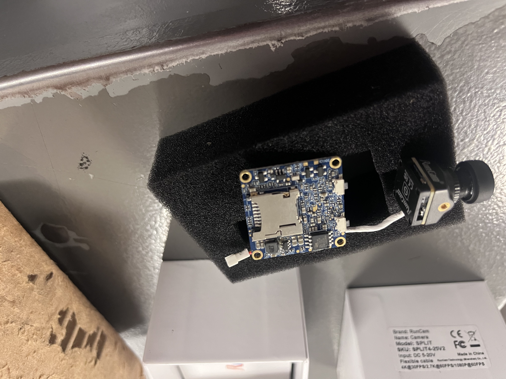
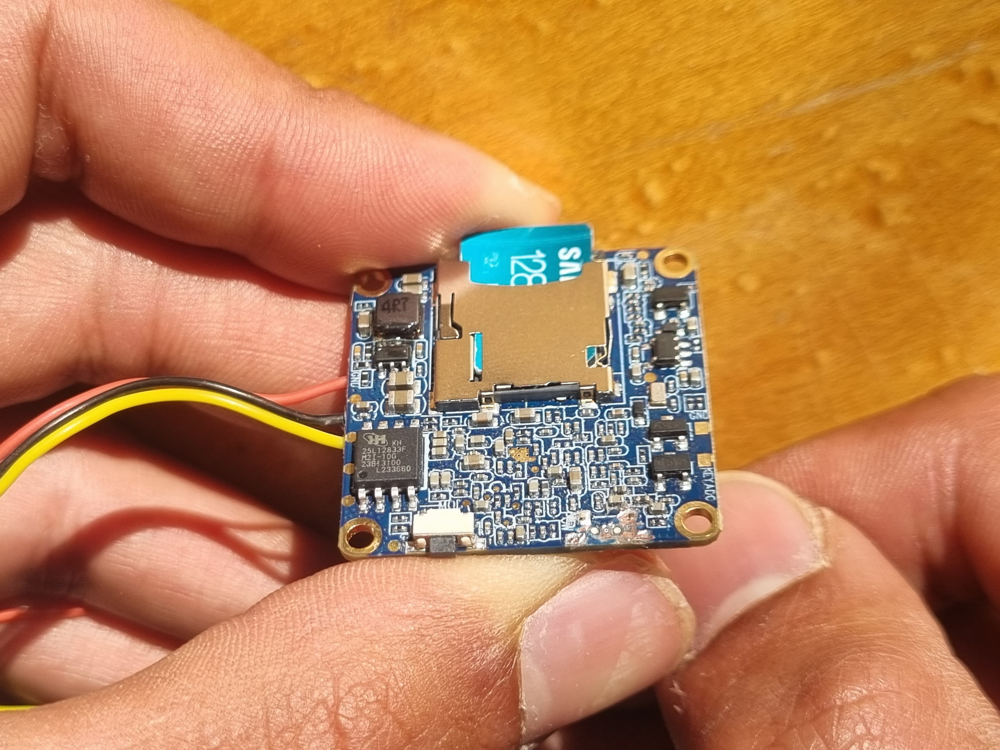
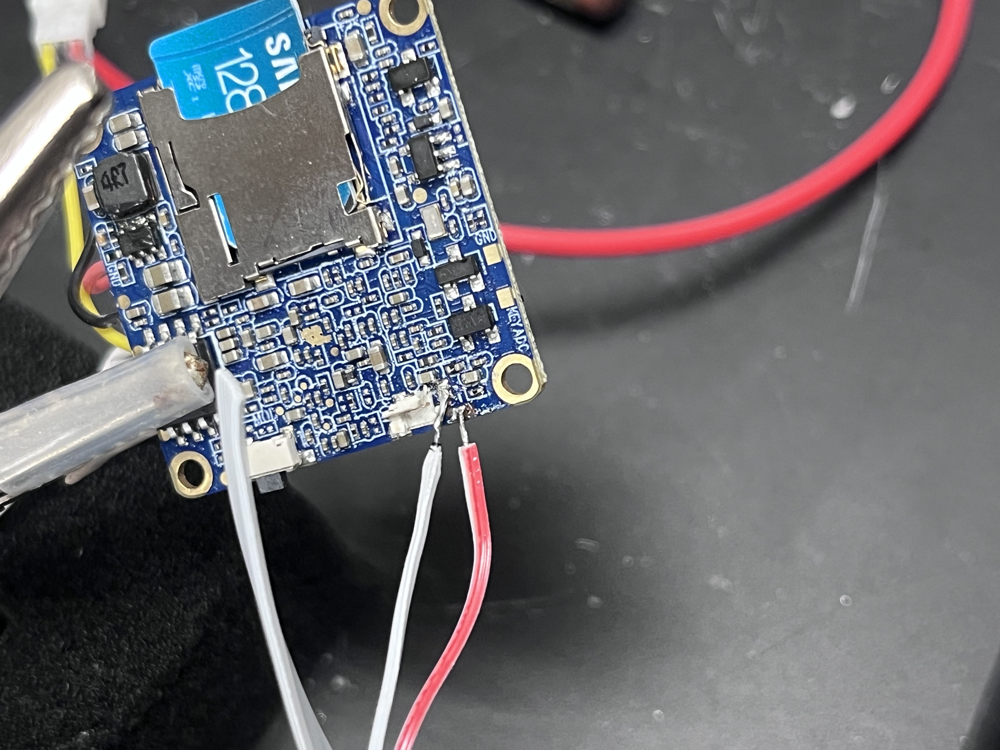
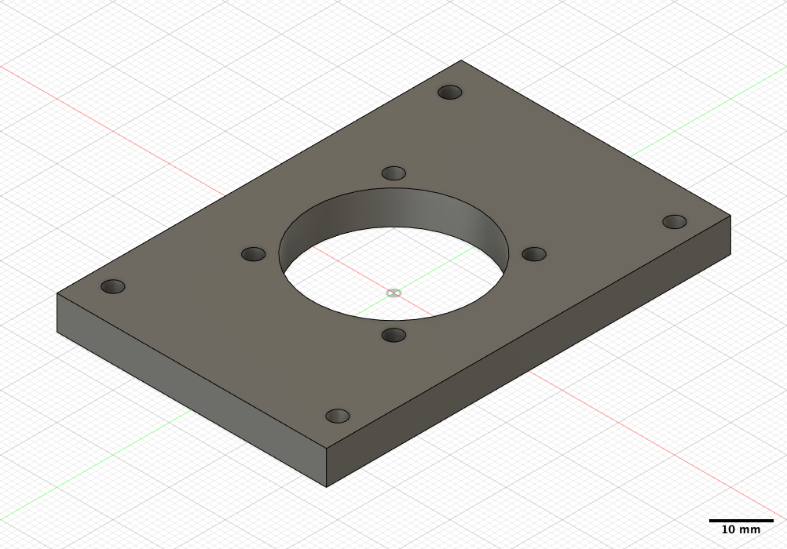
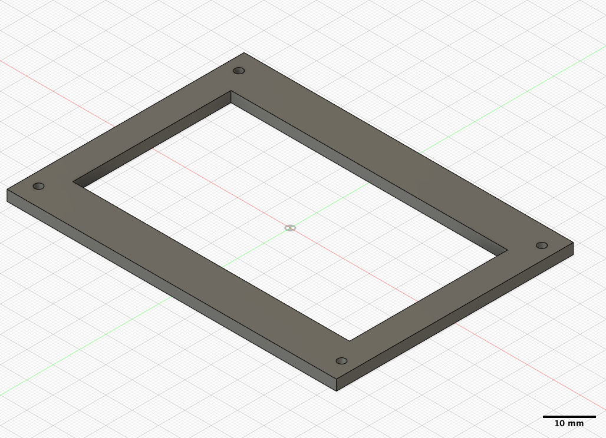
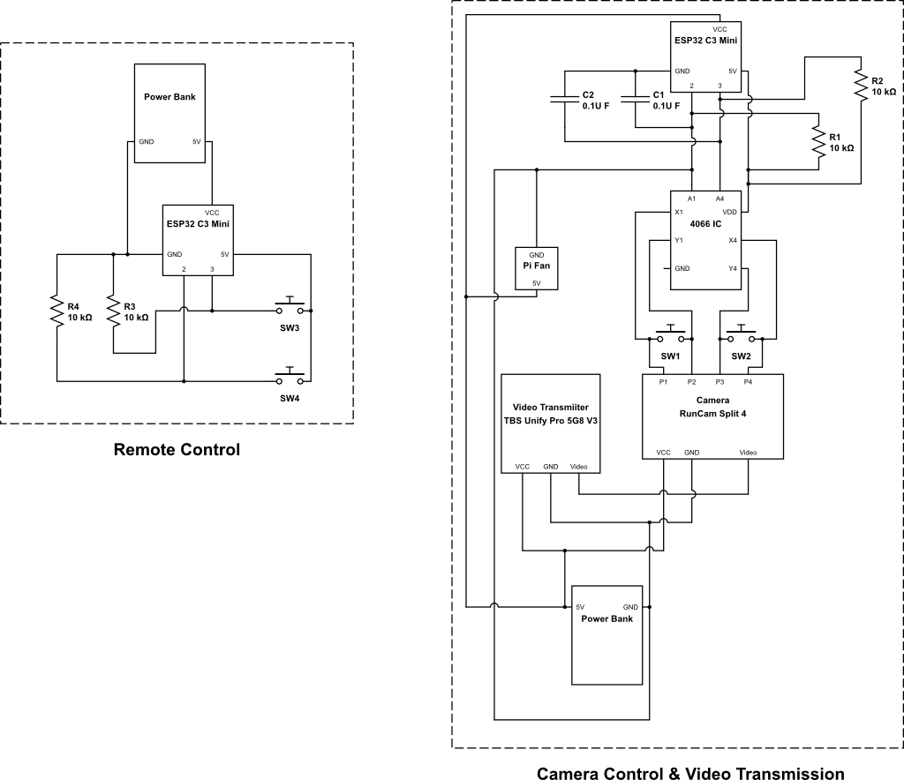

# Surgical Loupe Video Recording System
# Technical Documentation

**Modlab UPenn**  
**April 2025**

## Abstract
This document outlines the development of a specialized video recording system designed for integration with surgical loupes, developed for Dr. Sonul Mehta from Penn Medicine through Modlab UPenn. The project addresses the need for micro-surgeons performing delicate procedures to record their activities with minimal interference to their work. The system utilizes FPV (First Person View) drone technology adapted for medical applications, allowing surgeons to record procedures from their perspective while maintaining sterility in the operating environment through a remote control system.

## 1 System Requirements
Based on the project brief from Modlab UPenn (January 2025) and subsequent development decisions:
* **Lightweight Design**: Minimizing additional weight on surgeon's loupes
* **Non-Obstructive**: Must not block or impair the surgeon's field of view
* **High Resolution**: 4K video capture for effective post-processing zoom
* **Sterile Operation**: Some way to operate the camera without compromising the sterility of the OR
* **Minimum 1-Hour Runtime**: Battery life sufficient for standard procedures

## 2 System Concept
After exploring options to develop a custom recording system from scratch, we determined that achieving the required resolution in a lightweight, compact package suitable for loupe mounting would be infeasible with our resources. Commercial FPV (First Person View) drone camera systems emerged as an ideal alternative, offering excellent video quality in an extremely compact form factor.

However, these systems presented an integration challenge as they're typically controlled through a drone's flight controller (FC). Our solution was to interface with the camera by simulating physical button presses using a CD4066 IC analog switch. By connecting to exposed pads of the switches on the camera's PCB, we could remotely trigger camera functions through our custom control system while maintaining the camera's original functionality and performance characteristics.

Initially, voice command control was proposed for sterile operation, but was abandoned due to reliability issues in the OR environment. A remote control solution was settled on as a more reliable alternative, with sterility maintained by covering the remote controller with new sterile film for each procedure.

This approach allowed us to leverage existing high-performance technology while adapting it to the specific requirements of a surgical environment. The system utilizes this modified FPV drone technology and aims to allow surgeons to record procedures from their perspective while maintaining sterility through a wireless remote control system.

## 3 Hardware Components

### 3.1 Camera System
* **Camera**: RunCam Split 4
  * **Dimensions**: 29mm × 29mm (lens module), 14mm × 14mm (PCB)
  * **Weight**: 10.2g
  * **Video Capabilities**: 4K@30fps, 2.7K@60fps, 2.7K@50fps, 1080P@60fps
  * **Storage Capacity**: Supports up to 128GB microSD card (U3 recommended)
  * **Field of View (FOV)**: 140°
  * **Sensor**: SONY 13MP
  * **Video Format**: MP4
  * **Storage Efficiency**: 4K 30fps footage requires approximately 83MB for 33 seconds of video
    * This equals about 151MB per minute or 9.1GB per hour
    * With 128GB storage, this provides approximately 14 hours of continuous 4K recording

The camera mounts directly to the surgical loupes, adding minimal weight to the surgeon's equipment. Testing in surgical lighting conditions showed we need to play with brightnesss and contrast in post editting to achieve adequate detail for post-procedure analysis.

### 3.2 Control System
* **Main Controller**: ESP32 C3 SuperMini
  * **Wireless Protocol**: ESP-NOW for low-latency communication
  * **Connectivity**: Interfaces with the camera control circuit via GPIO pins
  * **Power Draw**: Approximately 100mA during active transmission
  * **Dimensions**: 34.3mm × 20.3mm
  * **Weight**: 3g

* **Remote Controller**: Secondary ESP32 C3 SuperMini
  * **Design**: Housed in a compact 3D-printed case with physical buttons
  * **Interface**: Two tactile buttons for core functions (Start/Stop Recording, Mode Switch)
  * **Range**: Yet to be tested
  * **Sterility Solution**: Designed to be wrapped in sterile film for OR use

The ESP-NOW protocol was selected for its reliability in electromagnetically noisy environments like operating rooms. The wireless connection exhibited consistent performance in testing, with no noticeable latency between button press and response.

### 3.3 Circuit Components
* **Analog Switch**: CD4066 IC
  * **Function**: Simulates physical button presses on the camera
  * **Operation Voltage**: 5V 
  * **Control Method**: Digital signals from ESP32 activate switches corresponding to camera buttons

* **Pull-up Resistors**: 10kΩ (R1 and R2)
  * **Purpose**: Prevents unwanted triggering when system is unpowered
  * **Rating**: 1/4W, standard tolerance

* **Decoupling Capacitors**: 0.1µF (C1 and C2)
  * **Purpose**: Provides noise filtering and debounce protection for clean switching
  * **Type**: Ceramic, low ESR

#### 3.3.1 Camera PCB Modification Process
**Tools Required:**
- Dremel rotary tool with precision cutting/grinding bit
- Magnifying glass or microscope (recommended)


**Process:**

1. Used a Dremel rotary tool on low speed to carefully remove the physical switch from the PCB
2. Ensured the exposed pads remained intact after switch removal

**Challenges Encountered:**
- The exposed pads are extremely small, requiring a soldering tip finer than what was available
- Direct soldering to these pads presents a risk of damaging the PCB with excessive heat
- Current status: Successfully removed the switch, but connection to the exposed pads remains a challenge







### 3.4 Video Transmission
* **Video Transmitter**: TBS Unify Pro 5G8 V3 (RP-SMA)
  * **Operating Voltage**: 4.5 - 5.5V
  * **Supply Current**: 600mA
  * **Output Power Options**: 13dBm (25mW), 23dBm (200mW), 27dBm (500mW), 29dBm (800mW)
  * **Video Format**: NTSC/PAL
  * **Weight**: 5g (with SMA, without antenna)
  * **Connector**: RP-SMA Female Socket with screw mounting holes

* **Cooling System**: Raspberry Pi fan
  * **Dimension**: 30mm × 30mm × 7mm
  * **Operating Voltage**: 5V
  * **Current Draw**: Approximately 100mA
  * **Mounting**: Direct attachment to the electronics housing with airflow directed at the video transmitter


### 3.5 Power System
* **Power Source**: Lightweight portable power bank
  * **Capacity**: 10,000mAh
  * **Output Ports**: Dual USB-A outputs (5V, 2.1A each)
  * **Dimensions**: 115mm × 70mm × 22mm
  * **Weight**: 180g
  * **Mounting**: Belt-mounted using the custom 3D-printed housing

* **Power Distribution**:
  * **Total System Current Draw**: Approximately 0.8A (Camera + Video Transmitter + Fan + ESP32 Controllers)
  * **Estimated Runtime**: Approximately 12 hours at full load
  * **Wiring**: 24 AWG silicone wire for flexibility and durability

The power system is designed to be entirely belt-mounted, avoiding any additional weight on the surgeon's head. A single cable runs from the belt unit to the loupe-mounted camera, minimizing the impact on mobility.

### 3.6 Physical Housing
* **Camera & Electronics Mount**: Custom 3D-printed housing
  * **Material**: PLA
  * **Design Features**:
    * Compartmentalized sections for power bank, controller MCU & 4066 IC circuit, video transmitter
    * Ventilation channels for cooling






## 4 Circuit Design


The circuit design consists of two main sections:
1. **Remote Control Circuit**: ESP32 C3 SuperMini with tactile buttons and pull-up resistors
2. **Camera Control & Video Transmission Circuit**: ESP32 C3 SuperMini connected to CD4066 IC, which interfaces with the RunCam Split 4 camera and TBS Unify Pro video transmitter

## 5 Implementation Details

### 5.1 Sterile Remote Control System
The remote control system was developed as an alternative to voice commands, which were found to be unreliable in the operating room environment. Key features include:

* **Sterile Operation**: The remote control is designed to be wrapped in fresh sterile film for each procedure
* **Simple Button Interface**: Two clearly defined buttons for core functions that can be operated while wearing surgical gloves
  * **Button 1**: Start/Stop Recording
  * **Button 2**: Mode Switch (Video/OSD settings)
* **Feedback Mechanism**: LED indicators to confirm button presses and system status

Testing was done with a mock setup where instead of controlling the camera the remote controlled two LEDs.

### 5.2 Camera Control Interface
The RunCam Split 4 is interfaced through its button inputs. We propose the CD4066 IC act as an electronic switch, simulating button presses when triggered by the MCU based on remote commands. This approach will maintain the original camera functionality while adding remote control capability.

The button simulation process will work as follows:
1. The remote control sends a command via ESP-NOW to the main controller
2. The main controller activates the appropriate switch in the CD4066 IC
3. The CD4066 connects the corresponding pads on the camera PCB
4. The camera interprets this as a physical button press

### 5.3 Wireless Command Protocol
Commands from the remote control unit are transmitted to the main MCU via ESP-NOW, which provides:
1. Low-latency communication (important for responsive camera control)
2. Reliable operation in the electromagnetically noisy OR environment
3. Error checking to ensure command integrity
4. Simple pairing process for quick setup

The ESP-NOW implementation uses a basic message structure:
```
struct cmd_data {
  uint8_t command;  // 0: No command, 1: Record, 2: Mode switch
  uint8_t state;    // 0: Button released, 1: Button pressed
};
```

This efficient protocol minimizes transmission overhead and power consumption.

### 5.4 Thermal Considerations
The video transmitter generates significant heat during operation. The Pi fan provides active cooling to prevent hardware damage, ensuring consistent performance throughout extended procedures.

Temperature testing is yet to be done on the system.


## 6 Advantages and Applications
* **Procedure Documentation**: High-quality 4K recording for training and review
* **Remote Consultation**: Real-time feed sharing with specialists
* **Medical Education**: Creation of educational materials from surgeon's perspective
* **Patient Communication**: Visual aids for explaining procedures to patients

## 7 Future Enhancements
* **Motorized Tilt System**: Implementation of remotely controlled camera angle adjustment
* **Extended Battery Life**: Development of lightweight power solutions for 12+ hour runtime
* **Addition of Audio Recording**: Voice annotation capability during procedures
* **Cloud Backup**: Automatic backup for video recordings


## 8 Prototype Performance Assessment
The current prototype demonstrates the following performance characteristics relative to the original requirements:

* **Lightweight Design**: Success 
* **Non-Obstructive**: Partial success - we were able to model a camera mount with a minimal design but to have a reliable mount we would have to have access to the loupe.
* **High Resolution**: Successful - 4K video capture provides excellent detail for post-processing
* **Sterile Operation**: Partial success - Remote control using CD4066 IC on a mock circuit with 2 LEDs works but since we havent been able to silder to the exposed switch pads on the camera PCB we dont have a fully remote recording system yet 
* **Minimum 1-Hour Runtime**: Successful - System achieved 1 hour of runtime without hurting any components due to overheating or running out of storage.

**Challenges and Limitations**:
PCB connection reliability remains the primary technical challenge. Even when I was able to solder the leads onto the PCB it was too close to a capacitor and the camera kept shorting and power cycling.

## 9 Conclusion
This surgical loupe video recording system represents an innovative application of consumer electronics technology in a medical setting. By adapting FPV drone equipment for surgical use, the system provides high-quality video recording capabilities controlled through a sterile remote interface, allowing surgeons to document procedures without compromising sterility or adding significant weight to their equipment.

The design prioritizes the specific needs of micro-surgeons performing delicate procedures while offering a pathway to enhanced functionality through future iterations. The system is currently in the prototype phase with core functionality implemented and testing underway in controlled environments.

## Appendix A: Bill of Materials


| Component | Specification | Supplier | Cost |
|-----------|---------------|----------|------|
| RunCam Split 4 | 4K FPV Camera | Amazon |  $109.00 |
| ESP32 C3 SuperMini (×2) | Development Board | Amazon |  $5.99 each |
| TBS Unify Pro 5G8 V3 (SMA) | Video Transmitter | GetFPV | $39.99 |
| CD4066 IC | Quad Bilateral Switch (20pcs) | Amazon |  $7.99 |
| SAMSUNG EVO Select microSD | Memory Card + Adapter, 128GB | Amazon |  $13.99 |
| SoloGood FPV Monitor | 4.3inch with DVR 5.8Ghz 40CH 800×480 | Amazon  | $62.99 |
| Smaller Antennas | Compact 5.8GHz | Amazon  | $7.00 |
| Cooling Fans | 5V 30mm | Amazon  | $7.00 |


## Appendix B: Special Tools Required
* Dremel rotary tool with precision bits
* Soldering iron with micro-tip (smaller than standard tips)


